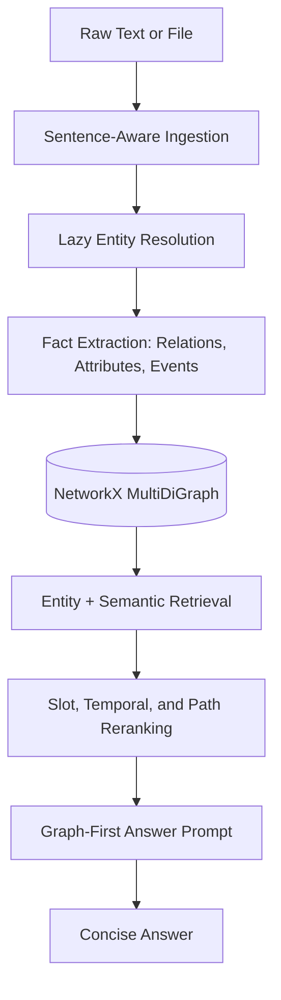

# ProRAG - Proactive GraphRAG

ProRAG is a minimal entity-graph RAG runtime for grounded question answering. It ingests text into a knowledge graph, resolves references during ingestion, retrieves graph evidence with entity-first ranking, and answers with a single LLM synthesis call.

## Architecture



## What Is Production-Oriented Now

- **Adaptive ingestion:** Short passages resolve entities in one pass; long files use overlapping sentence chunks with entity memory carried forward.
- **Lazy context expansion:** A chunk only retries with previous context when entity resolution returns unresolved mentions.
- **Graph-first QA:** Answers are generated from selected graph facts by default.
- **Optional source snippets:** Raw text snippets can be included as supporting context with `include_source_text=True`.
- **Cost/quality modes:** `cheap`, `balanced`, and `quality` tune token budgets and lazy retries.
- **LLM response cache:** Optional file-backed cache avoids repeated API calls for identical prompts.
- **Offline embedding fallback:** A local sentence-transformer model is preferred when present; a hash embedding fallback keeps retrieval usable without it.

## Install

```bash
python -m venv .venv
source .venv/bin/activate
pip install -e .
```

For development:

```bash
pip install -e ".[dev]"
```

Set a provider key before using the default Groq backend:

```bash
cp .env.example .env
export GROQ_API_KEY=your_key_here
```

On Windows PowerShell:

```powershell
python -m venv .venv
.\.venv\Scripts\Activate.ps1
pip install -e .
Copy-Item .env.example .env
$env:GROQ_API_KEY = "your_key_here"
```

ProRAG does not ship a local embedding model. Set `PRORAG_EMBEDDING_MODEL` to a
SentenceTransformers model name or local path if you want semantic embeddings:

```bash
export PRORAG_EMBEDDING_MODEL=sentence-transformers/all-MiniLM-L6-v2
```

If the model is unavailable, ProRAG falls back to deterministic hash embeddings
so local tests and keyword-oriented retrieval still work.

## Quickstart

```python
from prorag import ProRAG

rag = ProRAG(quality_mode="balanced")
rag.ingest(
    "Christopher Nolan directed Inception. "
    "Inception was filmed in Paris and Tokyo."
)

result = rag.ask("Where was the film directed by Christopher Nolan filmed?")
print(result["answer"])
print(result["sources"])
```

## Cost / Quality Modes

| Mode | Use when | Behavior |
| --- | --- | --- |
| `cheap` | Cost matters most | Shorter outputs, fewer lazy retries |
| `balanced` | Default use | Moderate token budgets and retries |
| `quality` | Recall matters most | Larger token budgets and more lazy retries |

```python
rag = ProRAG(quality_mode="balanced")
rag.ingest_file("notes.txt", quality_mode="cheap")
result = rag.ask("Who directed Inception?", quality_mode="quality")
```

## Optional Source Snippets

By default, ProRAG answers from graph facts only. To include short source snippets as supporting context:

```python
result = rag.ask(
    "Who directed Inception?",
    include_source_text=True,
    max_source_chars=1200,
)
```

The answer prompt still treats graph facts as primary evidence and snippets as support only.

## LLM Cache

Enable cache for repeated benchmark or ingestion runs:

```bash
export PRORAG_LLM_CACHE=1
export PRORAG_LLM_CACHE_PATH=.prorag_cache/llm_cache.json
```

PowerShell:

```powershell
$env:PRORAG_LLM_CACHE = "1"
$env:PRORAG_LLM_CACHE_PATH = ".prorag_cache/llm_cache.json"
```

The cache key includes provider, model, token budget, system prompt, and prompt text. It is disabled by default.

## CLI

```bash
prorag ingest notes.txt --graph graph.json
prorag ingest notes.txt --graph graph.json --quality-mode cheap
prorag ask "Who directed Inception?" --graph graph.json
prorag ask "Who directed Inception?" --graph graph.json --quality-mode quality
prorag ask "Who directed Inception?" --graph graph.json --include-source-text
prorag interactive --graph graph.json
prorag stats --graph graph.json
```

Global options are also accepted before the subcommand:

```bash
prorag --graph graph.json --quality-mode balanced stats
```

## Runtime Flow

### Ingestion

1. `ingest_file()` routes short files directly to `ingest_text()`.
2. Long files are split into overlapping sentence chunks.
3. Each chunk resolves entities with the current entity registry.
4. If unresolved mentions appear, resolution retries with prior sentence context.
5. Facts are extracted into relations, attributes, and events.
6. Each fact is written with a chunk-level source ID for later grounding.

### Retrieval

1. The question is classified into a slot such as `who`, `where`, `when`, or `how_many`.
2. Seed entities are detected with lexical and semantic matching.
3. Candidate triples are retrieved with semantic graph traversal and keyword fallback.
4. Triples are reranked by entity alignment, relation cues, temporal hints, confidence, and path connectivity.
5. The answer prompt receives graph facts, plus optional supporting source snippets.

## Development

```bash
pytest tests -q
python -m compileall prorag tests
python -m ruff check .
```

## Current Limits

- Graph storage is still in-memory `networkx.MultiDiGraph` with JSON persistence.
- Vector retrieval is a local linear scan, suitable for prototypes and small corpora.
- Concurrent writes are not transaction-safe.
- Relation normalization is still mostly LLM-driven and should become schema-backed for strict production deployments.

For larger deployments, move graph storage to a graph database, move semantic lookup to a vector index, and add a job queue around ingestion.

## License

Apache License 2.0. See `LICENSE`.
