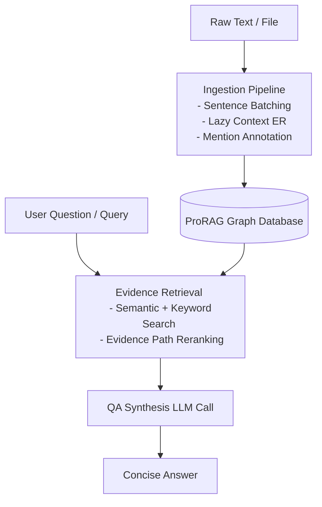

# ProRAG — Proactive GraphRAG

Minimal entity-graph RAG for grounded question answering.

ProRAG ingests text into an entity graph, resolves simple references during ingest, retrieves graph evidence with entity-first ranking, and answers with one LLM call.

---

## Architecture Overview

ProRAG uses a two-phase architecture: **Grounded Knowledge Graph Ingestion** and **Context-Guided Graph Retrieval**.



---

## Detailed Step-by-Step Function Guide

### 1. Ingestion Phase (Data In)

The ingestion pipeline transforms raw text files or strings into structured graph facts using the following sequence of functions in [extractor.py](file:///c:/Users/hanng/Downloads/prorag-repo/prorag/extractor.py):

1. **[ingest_file()](file:///c:/Users/hanng/Downloads/prorag-repo/prorag/extractor.py#L294):** 
   - Entry point for file ingestion.
   - Reads the full text of the file and calls `ingest_text()` directly, skipping character-based chunking.
2. **[ingest_text()](file:///c:/Users/hanng/Downloads/prorag-repo/prorag/extractor.py#L237):** 
   - Splits text into sentences using regex `(?<=[.!?\n])\s+`.
   - Groups sentences into batches of size 8.
   - For each batch, computes preceding sentences (up to 8) as history and calls `resolve_entities()`.
   - Annotates the text via `substitute_mentions()` and extracts facts via `extract_facts()`.
   - Routes facts to the database using `graph.add_relation()`, `graph.add_attribute()`, or `graph.add_event()`.
3. **[resolve_entities()](file:///c:/Users/hanng/Downloads/prorag-repo/prorag/extractor.py#L110):** 
   - Resolution starts with no context.
   - If any mention maps to `null` (None), it retries with context (up to 2 retries, prepending 4 preceding sentences from history per retry).
   - Supports backward compatibility: if a `set` is passed as the second argument, it behaves as the old `entity_registry` candidate list without retrying.
4. **[substitute_mentions()](file:///c:/Users/hanng/Downloads/prorag-repo/prorag/extractor.py#L157):** 
   - Replaces resolved mentions in the text with `[canonical_name]`.
   - Sorts mentions by length descending to prevent substring collisions.
   - Uses unique placeholders (`___ENTITY_PLACEHOLDER_{i}___`) to prevent nested bracket errors (e.g. replacing "Steve" inside `[steve jobs]` to become `[[steve] jobs]`).
5. **[extract_facts()](file:///c:/Users/hanng/Downloads/prorag-repo/prorag/extractor.py#L178):** 
   - Prompts the LLM with annotated text to extract relations, attributes, and events between bracketed names.
   - Filters facts: drops facts where the subject is not a resolved canonical entity, or if subject/object belongs to a mention that resolved to `null`.
6. **[_prepare_fact()](file:///c:/Users/hanng/Downloads/prorag-repo/prorag/extractor.py#L351):** 
   - Normalizes and formats the extracted fact based on its type (`relation`, `attribute`, or `event`). Parses negation, confidence, statement time, temporal aspect, and other metadata fields.
7. **[_is_valid_triple()](file:///c:/Users/hanng/Downloads/prorag-repo/prorag/extractor.py#L370):** 
   - Standard validator that checks that the subject, relation, and object are not empty.

### 2. Retrieval & QA Phase (Query Out)

The retrieval and QA pipeline processes user questions and synthesizes grounded answers using the following sequence of functions in [pipeline.py](file:///c:/Users/hanng/Downloads/prorag-repo/prorag/pipeline.py):

1. **[answer()](file:///c:/Users/hanng/Downloads/prorag-repo/prorag/pipeline.py#L60):** 
   - High-level QA entry point.
   - Calls `retrieve_evidence()` to search and select graph facts.
   - Formats facts (including rich metadata suffixes like aspect, modality, etc.) and their corresponding raw source text chunks via `_format_context()`.
   - Feeds formatted context to the LLM via `_ANSWER_PROMPT` to synthesize a concise answer.
2. **[retrieve_evidence()](file:///c:/Users/hanng/Downloads/prorag-repo/prorag/pipeline.py#L89):** 
   - Identifies the question slot category via `detect_question_slot()`.
   - Extracts seed entities via lexical overlap (matching both primary name and aliases) and semantic vector matching (`_detect_seed_entities()`).
   - Retrieves candidate graph triples using vector search (`graph.query_vector()`) or keyword search.
   - Scores and reranks triples based on semantic similarity, slot matching, aspect matching, and contradiction penalties.
   - Traces path connections and returns the top-k evidence triples.
3. **[detect_question_slot()](file:///c:/Users/hanng/Downloads/prorag-repo/prorag/pipeline.py#L125):** 
   - Routes questions into one of the 5W1H categories using prefix matching or `_SLOT_HINTS`.
4. **[detect_question_aspect()](file:///c:/Users/hanng/Downloads/prorag-repo/prorag/pipeline.py#L225):** 
   - Evaluates keywords (`plan`, `did`, `was`) to set the question's temporal aspect (PAST/PRESENT/FUTURE).

---

### Ingestion Pipeline

Instead of arbitrary character-based chunking, ProRAG uses semantic sentence-level batching combined with a multi-step entity resolution and relation extraction pipeline.

* **Sentence Batching:** Input text is parsed into individual sentences and grouped into batches of size 8. This preserves sentence boundaries and keeps local context coherent.
* **Lazy Context Expansion:** 
  For each batch, entity resolution is performed using the `_ENTITY_RESOLUTION_PROMPT`. If any mention fails to resolve (returns `null`), the system enters a retry loop (max 2 retries). On each retry, it prepends the preceding `N` sentences from history (4 sentences per retry) as background context to help resolve ambiguous pronouns ("he", "it", "they") or generic references ("the company") to their canonical names.
* **Mention Substitution & Annotation:**
  Resolved mentions are replaced in the text with `[canonical_name]`. Mentions are sorted by length descending to prevent replacing substrings prematurely. To avoid nested replacements (e.g. replacing "Steve" inside `[steve jobs]`), it temporarily swaps mentions with unique placeholders before writing out the final bracketed text.
* **Annotated Relation & Fact Extraction:**
  The fact extraction prompt receives the annotated text. The LLM only needs to identify relations, attributes, or events between bracketed entities rather than guessing names. If a subject or object was mapped to `null` in the entity map, it is dropped programmatically during validation.

### 2. Graph Storage

* **Graph Representation:** Backed by `networkx.MultiDiGraph`.
* **Conflict & Contradiction Detection:** If a triple with the same subject, object, and relation is added but with an opposite negation flag, ProRAG marks them as contradicting (`CONTRADICTS:relation`) and applies a confidence penalty.
* **Chunk Storage:** The original text chunks are stored in the graph linked to their source IDs so they can be retrieved later to provide rich grounded context.

### 3. Retrieval & QA Pipeline

* **Keyword & Semantic Retrieval:** Seed entities are extracted from the user's question. A semantic search (`query_vector`) uses cosine similarity between the query embedding and the entity nodes to select seed entities, followed by a BFS traversal weighted by relation similarity.
* **Triple Reranking:** Evidence triples are ranked using a scoring function based on:
  - Vector similarity to the question.
  - Entity alignment with seed entities.
  - Relation cues matching the question slot (e.g., preferring location-based relations for "Where" questions).
  - Temporal aspect alignment ("PAST", "PRESENT", "FUTURE").
  - Contradiction penalties.
* **Context Formatting & QA Synthesis:** The top retrieved facts and their corresponding raw text chunks are formatted as a prompt context for the LLM. If contradictions are present, a warning footnote is appended to the answer.

---

## Install

```bash
pip install -e .
```

Set a provider key before using the default Groq backend:

```bash
export GROQ_API_KEY=your_key_here
```

## Quickstart

```python
from prorag import ProRAG

rag = ProRAG()
rag.ingest("Christopher Nolan directed Inception. Inception was filmed in Paris and Tokyo.")

result = rag.ask("Where was the film directed by Christopher Nolan filmed?")
print(result["answer"])
print(result["sources"])
```

## CLI

```bash
prorag ingest notes.txt --graph graph.json
prorag ask "Who directed Inception?" --graph graph.json
prorag interactive --graph graph.json
prorag stats --graph graph.json
```

## Development

```bash
pytest -q --basetemp C:\tmp\prorag-pytest -o cache_dir=C:\tmp\prorag-pytest-cache
python -m compileall prorag tests
```

## License

Apache License 2.0. See `LICENSE`.
