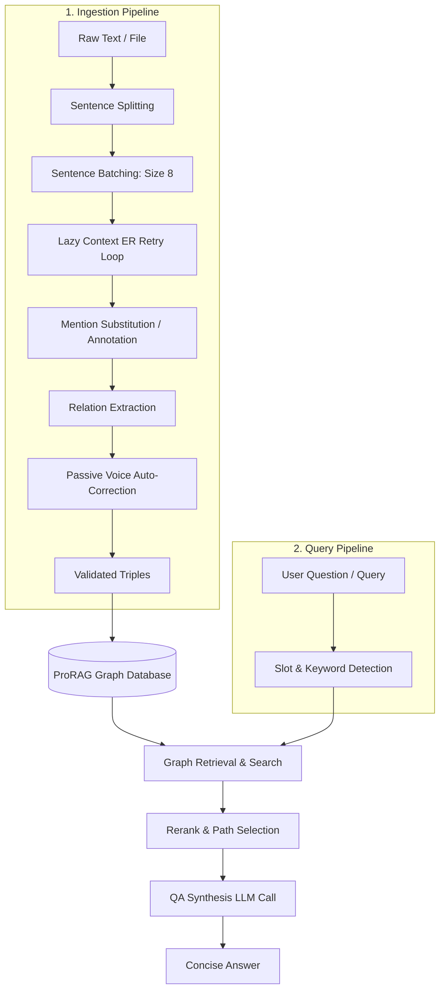

# ProRAG — Proactive GraphRAG

Minimal entity-graph RAG for grounded question answering.

ProRAG ingests text into an entity graph, resolves simple references during ingest, retrieves graph evidence with entity-first ranking, and answers with one LLM call.

---

## Architecture Overview

ProRAG uses a two-phase architecture: **Grounded Knowledge Graph Ingestion** and **Context-Guided Graph Retrieval**.



### 1. Ingestion Pipeline

Instead of arbitrary character-based chunking, ProRAG uses semantic sentence-level batching combined with a multi-step entity resolution and relation extraction pipeline.

* **Sentence Batching:** Input text is parsed into individual sentences and grouped into batches of size 8. This preserves sentence boundaries and keeps local context coherent.
* **Lazy Context Expansion:** 
  For each batch, entity resolution is performed using the `_ENTITY_RESOLUTION_PROMPT`. If any mention fails to resolve (returns `null`), the system enters a retry loop (max 2 retries). On each retry, it prepends the preceding `N` sentences from history (4 sentences per retry) as background context to help resolve ambiguous pronouns ("he", "it", "they") or generic references ("the company") to their canonical names.
* **Mention Substitution & Annotation:**
  Resolved mentions are replaced in the text with `[canonical_name]`. Mentions are sorted by length descending to prevent replacing substrings prematurely. To avoid nested replacements (e.g. replacing "Steve" inside `[steve jobs]`), it temporarily swaps mentions with unique placeholders before writing out the final bracketed text.
* **Annotated Relation Extraction:**
  The relation extraction prompt (`_EXTRACT_PROMPT`) receives the annotated text. The LLM only needs to identify relationship verbs between bracketed entities rather than guessing names. If a subject or object was mapped to `null` in the entity map, it is dropped programmatically during validation.
* **Passive Voice Safety Net:**
  Even when instructed to output active voice, LLMs occasionally return passive voice relations (e.g., `"was released by"` or `"được phát triển bởi"`). The `_fix_passive()` helper catches these patterns in Python, swaps the subject and object, strips the passive voice markers, and normalizes the relation to active voice before graph write.

### 2. Graph Storage

* **Graph Representation:** Backed by `networkx.MultiDiGraph`.
* **Conflict & Contradiction Detection:** If a triple with the same subject, object, and relation is added but with an opposite negation flag, ProRAG marks them as contradicting (`CONTRADICTS:relation`) and applies a confidence penalty.
* **Chunk Storage:** The original text chunks are stored in the graph linked to their source IDs so they can be retrieved later to provide rich grounded context.

### 3. Retrieval & QA Pipeline

* **Keyword & Semantic Retrieval:** Seed entities are extracted from the user's question. A semantic search (`query_vector`) uses cosine similarity between the query embedding and the entity nodes to select seed entities, followed by a BFS traversal weighted by relation similarity.
* **Triple Reranking:** Evidence triples are ranked using a scoring function based on:
  - Vector similarity to the question.
  - Entity alignment with seed entities.
  - Relation cues matching the question slot (e.g., preferring location-based relations for "Where" questions).
  - Temporal aspect alignment ("PAST", "PRESENT", "FUTURE").
  - Contradiction penalties.
* **Context Formatting & QA Synthesis:** The top retrieved facts and their corresponding raw text chunks are formatted as a prompt context for the LLM. If contradictions are present, a warning footnote is appended to the answer.

---

## Install

```bash
pip install -e .
```

Set a provider key before using the default Groq backend:

```bash
export GROQ_API_KEY=your_key_here
```

## Quickstart

```python
from prorag import ProRAG

rag = ProRAG()
rag.ingest("Christopher Nolan directed Inception. Inception was filmed in Paris and Tokyo.")

result = rag.ask("Where was the film directed by Christopher Nolan filmed?")
print(result["answer"])
print(result["sources"])
```

## CLI

```bash
prorag ingest notes.txt --graph graph.json
prorag ask "Who directed Inception?" --graph graph.json
prorag interactive --graph graph.json
prorag stats --graph graph.json
```

## Development

```bash
pytest -q --basetemp C:\tmp\prorag-pytest -o cache_dir=C:\tmp\prorag-pytest-cache
python -m compileall prorag tests
```

## License

Apache License 2.0. See `LICENSE`.
