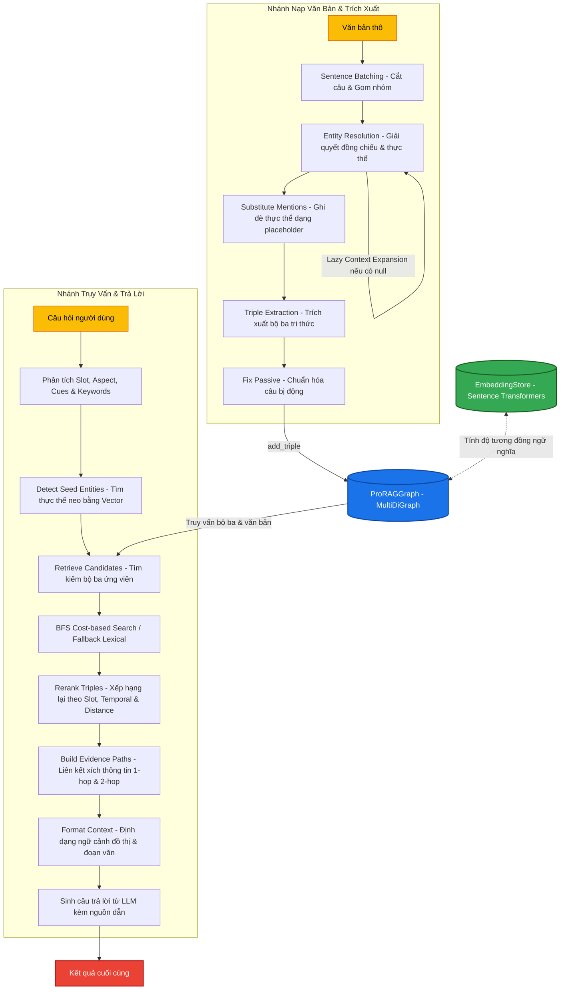

# Chi tiết Kiến trúc Hệ thống & Từng Hàm trong ProRAG

Tài liệu này phân tích chi tiết cấu trúc thiết kế, luồng dữ liệu hình chữ Y (Y-shaped pipeline) và giải thích cụ thể nhiệm vụ của từng hàm trong codebase **ProRAG**.

---

## 1. Sơ đồ Luồng Tổng Quan (Y-Shaped Workflow)

Kiến trúc ProRAG gồm hai nhánh độc lập hội tụ tại Kho lưu trữ đồ thị **ProRAGGraph**:
1. **Ingestion/Extraction Pipeline** (Nhánh Trái): Tiếp nhận văn bản thô, giải quyết đồng chiếu, chuẩn hóa thực thể và quan hệ, phát hiện mâu thuẫn để xây dựng Đồ thị tri thức.
2. **Retrieval/QA Pipeline** (Nhánh Phải): Phân tích câu hỏi (slots, cues, aspects), tìm kiếm ngữ nghĩa kết hợp duyệt đồ thị, xếp hạng lại (reranking) và sinh câu trả lời bằng LLM kèm nguồn dẫn chi tiết.



---

## 2. Phân Tích Nhánh Nạp Văn Bản (Ingestion Pipeline)

Nhánh này nằm chủ yếu tại file [extractor.py](file:///c:/Users/hanng/Downloads/prorag-repo/prorag/extractor.py). Nhiệm vụ của nó là chuyển đổi văn bản tự do thành đồ thị tri thức nhất quán về mặt ngôn ngữ và cấu trúc.

### 2.1. Hàm [ingest_text](file:///c:/Users/hanng/Downloads/prorag-repo/prorag/extractor.py#L207)
*   **Tham số**: `text` (văn bản thô), `graph` (đối tượng đồ thị [ProRAGGraph](file:///c:/Users/hanng/Downloads/prorag-repo/prorag/graph.py#L36)), `entity_registry` (tập hợp thực thể cũ), `source` (ID nguồn văn bản), `llm_model` (mô hình sử dụng).
*   **Quy trình từng bước**:
    1.  Tạo mã hash MD5 từ văn bản để gán làm `source` nếu tham số này trống.
    2.  Lưu toàn bộ văn bản thô vào đồ thị thông qua `graph.add_chunk(source, text)` để hỗ trợ tham chiếu nguồn chi tiết khi trả lời câu hỏi.
    3.  Tách văn bản thành danh sách câu bằng Regular Expression `(?<=[.!?\n])\s+`.
    4.  Nhóm các câu thành từng batch có kích thước cố định là **8 câu** để tối ưu hóa context window và giữ nguyên tính liên kết ngữ nghĩa liền kề.
    5.  Với mỗi batch câu:
        *   Lấy các câu từ batch trước đó (tối đa 8 câu) làm lịch sử (`history_sentences`).
        *   Gọi [resolve_entities](file:///c:/Users/hanng/Downloads/prorag-repo/prorag/extractor.py#L87) để giải quyết đại từ và danh từ đại diện.
        *   Ghi nhận thực thể đã chuẩn hóa vào `all_resolved_entities`.
        *   Thay thế các từ ám chỉ trong văn bản thô bằng thực thể chuẩn hóa thông qua [substitute_mentions](file:///c:/Users/hanng/Downloads/prorag-repo/prorag/extractor.py#L138).
        *   Gọi [extract_triples](file:///c:/Users/hanng/Downloads/prorag-repo/prorag/extractor.py#L159) để trích xuất các bộ ba từ đoạn văn bản đã được chú thích thực thể chuẩn hóa.
        *   Đẩy từng bộ ba vào đồ thị thông qua phương thức `graph.add_triple()`.
*   **Kết quả trả về**: Bộ đôi `(total_triples, all_resolved_entities)`.

### 2.2. Hàm [resolve_entities](file:///c:/Users/hanng/Downloads/prorag-repo/prorag/extractor.py#L87)
*   **Nhiệm vụ**: Xác định toàn bộ đại từ (he, she, it, they...), danh từ chỉ định (the company, the device...) và map chúng về thực thể gốc (canonical name).
*   **Cơ chế Lazy Context Expansion (Mở rộng ngữ cảnh lười)**:
    1.  Ở lượt đầu (`retry == 0`), chỉ gửi văn bản của batch hiện tại cho LLM để phân tích.
    2.  Nếu LLM trả về bất kỳ thực thể nào có giá trị `null` (tức là không đủ thông tin để định danh đại từ/danh từ), hệ thống sẽ tăng kích thước ngữ cảnh lịch sử.
    3.  Mỗi lần retry (tối đa 2 lần), hệ thống sẽ gộp thêm **4 câu lịch sử** từ phía trước vào prompt dưới dạng ngữ cảnh tham khảo đặc biệt:
        *   `"Previous context (for reference only, do NOT resolve entities from this part): ..."`
    4.  Gửi lại yêu cầu tới LLM. Quy trình lặp dừng lại ngay khi giải quyết thành công hết thực thể (không còn giá trị `null`) hoặc đạt số lần retry tối đa.
*   **Kết quả trả về**: Từ điển mapping `{ "từ trong văn bản": "tên thực thể chuẩn hóa hoặc null" }`.

### 2.3. Hàm [substitute_mentions](file:///c:/Users/hanng/Downloads/prorag-repo/prorag/extractor.py#L138)
*   **Nhiệm vụ**: Chú thích (annotate) văn bản bằng cách bọc tên thực thể chuẩn hóa trong ngoặc vuông `[Canonical Name]` thay cho từ gốc.
*   **Thuật toán chống đè lặp (Overlap / Nesting Prevention)**:
    1.  Lọc ra các thực thể được map thành công và sắp xếp danh sách từ ám chỉ theo **độ dài giảm dần** (Length Descending). Việc này đảm bảo các cụm từ dài hơn (ví dụ: *"Steve Jobs's black turtleneck"*) được xử lý trước các cụm từ ngắn nằm bên trong nó (*"Steve Jobs"* hoặc *"turtleneck"*).
    2.  Thay thế từ ám chỉ bằng một placeholder tạm dạng `___ENTITY_PLACEHOLDER_{i}___` để tránh trường hợp thay thế chuỗi con của một từ đã được chuẩn hóa ở các vòng lặp sau.
    3.  Duyệt qua các placeholder tạm thời này và thay thế chúng bằng dạng chuẩn `[Tên thực thể]`.

### 2.4. Hàm [extract_triples](file:///c:/Users/hanng/Downloads/prorag-repo/prorag/extractor.py#L159)
*   **Nhiệm vụ**: Trích xuất bộ ba quan hệ từ văn bản đã được chú thích thực thể chuẩn hóa.
*   **Quy trình từng bước**:
    1.  Nếu đầu vào chưa có dấu ngoặc vuông chú thích thực thể, hàm tự động gọi [resolve_entities](file:///c:/Users/hanng/Downloads/prorag-repo/prorag/extractor.py#L87) và thực hiện chú thích văn bản.
    2.  Tạo prompt gửi cho LLM yêu cầu trích xuất thông tin dưới dạng mảng JSON gồm: `subject`, `relation`, `object`, `negated`, `condition`, `confidence`, `statement_time`, `temporal_aspect`.
    3.  Ép LLM tuân thủ ràng buộc nghiêm ngặt: **Chỉ trích xuất các chủ thể (subject) và đối tượng (object) trùng khít với các thực thể nằm trong ngoặc vuông `[...]`**.
    4.  Nhận kết quả thô và phân tích cú pháp mảng JSON.
    5.  Hậu xử lý lọc nhiễu: Loại bỏ các bộ ba chứa chủ thể hoặc đối tượng bị LLM phân tích nhầm sang một từ thuộc tập hợp các từ không giải quyết được (`null_mentions`).

### 2.5. Các hàm bổ trợ (Helpers) trong Ingestion:
*   [normalize_entity_name](file:///c:/Users/hanng/Downloads/prorag-repo/prorag/entity_utils.py#L40): Chuẩn hóa chuỗi bằng cách đưa về chữ thường, thay thế chuỗi khoảng trắng dài bằng một khoảng trắng đơn và loại bỏ các ký tự dấu câu thừa ở hai đầu chuỗi.
*   [_prepare_triple](file:///c:/Users/hanng/Downloads/prorag-repo/prorag/extractor.py#L338): Nhận dict thô từ LLM, chuẩn hóa các khóa chính (`subject`, `relation`, `object`), gán giá trị mặc định cho thông tin điều kiện, độ tin cậy và khía cạnh thời gian (`temporal_aspect`), sau đó gọi hàm xử lý câu bị động.
*   [_fix_passive](file:///c:/Users/hanng/Downloads/prorag-repo/prorag/extractor.py#L310): Phát hiện và chuẩn hóa câu bị động. Nếu quan hệ bắt đầu bằng `"was "` hoặc `"were "`, hàm sẽ:
    *   Đảo vị trí của `subject` và `object`.
    *   Cắt bỏ tiền tố `"was "`/`"were "` và các hậu tố `" by"` hoặc tiền tố `"by "` để chuyển động từ về thể chủ động (ví dụ: *"Apple was founded by Steve Jobs"* $\rightarrow$ *"Steve Jobs founded Apple"*).
*   [_parse_json_object](file:///c:/Users/hanng/Downloads/prorag-repo/prorag/extractor.py#L391) & [_parse_json_array](file:///c:/Users/hanng/Downloads/prorag-repo/prorag/extractor.py#L369): Các parser thông minh lọc thẻ `<think>...</think>` của các mô hình lý luận (như DeepSeek-R1) và dùng regex tìm khối `{...}` hoặc `[...]` để giải mã JSON khi LLM trả về văn bản kèm giải thích.

---

## 3. Phân Tích Nhánh Truy Vấn & Trả Lời (Retrieval/QA Pipeline)

Nhánh này nằm tại file [pipeline.py](file:///c:/Users/hanng/Downloads/prorag-repo/prorag/pipeline.py), phụ trách việc tìm kiếm tri thức phù hợp từ đồ thị và sinh câu trả lời.

### 3.1. Hàm [answer](file:///c:/Users/hanng/Downloads/prorag-repo/prorag/pipeline.py#L59)
*   **Nhiệm vụ**: Hàm entry-point của luồng RAG.
*   **Quy trình từng bước**:
    1.  Gọi [retrieve_evidence](file:///c:/Users/hanng/Downloads/prorag-repo/prorag/pipeline.py#L88) để lấy ra danh sách các bộ ba hữu ích nhất dựa trên nội dung câu hỏi.
    2.  Gọi [_format_context](file:///c:/Users/hanng/Downloads/prorag-repo/prorag/pipeline.py#L552) để định dạng hóa dữ liệu thành văn bản ngữ cảnh sạch sẽ cho LLM đọc.
    3.  Nếu không tìm thấy bất cứ bộ ba nào hợp lệ, trả về ngay chuỗi `"I don't have enough information to answer this."`.
    4.  Tạo prompt gộp ngữ cảnh đồ thị, chi tiết phân đoạn văn bản gốc và câu hỏi gốc để gửi tới LLM.
    5.  Nếu hệ thống phát hiện có mâu thuẫn dữ liệu (tồn tại quan hệ nghịch lý hoặc phủ định trực tiếp trong đồ thị), thêm dòng cảnh báo `_CONTRADICTIONS_NOTE` ở cuối câu trả lời để người dùng lưu ý.

### 3.2. Hàm [retrieve_evidence](file:///c:/Users/hanng/Downloads/prorag-repo/prorag/pipeline.py#L88)
*   **Nhiệm vụ**: Thực hiện truy xuất đa tầng để gom các bằng chứng thuyết phục nhất.
*   **Quy trình**:
    1.  Xác định loại câu hỏi thông qua [detect_question_slot](file:///c:/Users/hanng/Downloads/prorag-repo/prorag/pipeline.py#L124) (ví dụ: `who`, `when`, `where`...).
    2.  Gọi [_detect_seed_entities](file:///c:/Users/hanng/Downloads/prorag-repo/prorag/pipeline.py#L150) để tìm các thực thể mỏ neo nằm trong câu hỏi.
    3.  Gọi [_infer_relation_cues](file:///c:/Users/hanng/Downloads/prorag-repo/prorag/pipeline.py#L188) để suy đoán các từ gợi ý quan hệ.
    4.  Gọi [_retrieve_candidate_triples](file:///c:/Users/hanng/Downloads/prorag-repo/prorag/pipeline.py#L208) truy xuất danh sách bộ ba ứng viên từ đồ thị bằng tìm kiếm ngữ nghĩa hoặc tìm kiếm từ khóa.
    5.  Chạy thuật toán [_rerank_triples](file:///c:/Users/hanng/Downloads/prorag-repo/prorag/pipeline.py#L237) đánh giá độ khớp tổng thể.
    6.  Liên kết thông tin bằng cách xây dựng các đường đi logic 1-hop, 2-hop nhờ [_select_evidence](file:///c:/Users/hanng/Downloads/prorag-repo/prorag/pipeline.py#L299) và giới hạn số lượng bằng chứng trả về ở mức `top_k`.

### 3.3. Các hàm bổ trợ phân tích câu hỏi:
*   [detect_question_slot](file:///c:/Users/hanng/Downloads/prorag-repo/prorag/pipeline.py#L124): Phân loại câu hỏi thành các nhóm ý đồ (`who`, `what`, `when`, `where`, `why`, `how`, `how_many`). Ưu tiên khớp các cụm từ đặc trưng trước, nếu không khớp sẽ chấm điểm dựa trên tần suất xuất hiện của các từ gợi ý trong từ điển `_SLOT_HINTS`.
*   [detect_question_aspect](file:///c:/Users/hanng/Downloads/prorag-repo/prorag/pipeline.py#L228): Suy luận thì/thời điểm của câu hỏi (`PAST`, `PRESENT`, `FUTURE`) bằng cách tìm các từ chỉ hành động hoặc kế hoạch tương lai (như *will, plan, predict*) hoặc quá khứ (như *did, was, happened*).
*   [_detect_seed_entities](file:///c:/Users/hanng/Downloads/prorag-repo/prorag/pipeline.py#L150): Xác định thực thể neo (seed) bằng cách kết hợp:
    1.  Chấm điểm trùng lặp từ khóa (lexical score) giữa các node trong đồ thị và câu hỏi.
    2.  Tính điểm tương đồng vector (semantic score) của toàn bộ tên node với câu hỏi thông qua `EmbeddingStore`.
    3.  Gộp điểm với trọng số: $\text{Combined} = \text{Lexical} + \text{Semantic} \times 4.0$. Chọn ra top thực thể cao nhất.
*   [_infer_relation_cues](file:///c:/Users/hanng/Downloads/prorag-repo/prorag/pipeline.py#L188): Loại bỏ các thực thể neo ra khỏi câu hỏi, tách từ còn lại để giữ lại các động từ/giới từ chỉ quan hệ (như *by, in, at, on...*), kết hợp thêm gợi ý quan hệ tĩnh theo slot để làm tín hiệu lọc thông tin.

### 3.4. Hàm đánh giá và xếp hạng lại:
*   [_rerank_triples](file:///c:/Users/hanng/Downloads/prorag-repo/prorag/pipeline.py#L237): Điểm xếp hạng tổng hợp của từng bộ ba tri thức được tính dựa trên công thức đa yếu tố:
    $$\text{Score} = (\text{similarity} \times 1.6) + (\text{entity\_score} \times 1.5) + (\text{relation\_score} \times 1.3) + (\text{slot\_score} \times 1.2) + (\text{confidence} \times 0.2) + (\text{temporal\_score} \times 1.5) - (\text{distance} \times 0.35) + \text{contradiction\_penalty}$$
    *   `similarity`: Độ tương đồng ngữ nghĩa vector giữa câu hỏi và bộ ba.
    *   `entity_score`: Trùng khớp thực thể với thực thể neo (đặc biệt ưu tiên trùng ở Subject).
    *   `relation_score`: Trùng khớp giữa quan hệ bộ ba với từ gợi ý hoặc từ ngữ trong câu hỏi.
    *   `slot_score`: Độ tương thích cấu trúc giá trị của đối tượng với ý đồ câu hỏi (ví dụ: Câu hỏi `"where"` được cộng điểm lớn nếu `object` có định dạng giống địa điểm).
    *   `temporal_score`: Điểm thưởng khi trùng năm được hỏi hoặc trùng khía cạnh thời gian (`PAST`/`PRESENT`/`FUTURE`).
    *   `distance`: Hình phạt khoảng cách duyệt đồ thị (các quan hệ xa thực thể neo bị giảm điểm nhẹ).
    *   `contradiction_penalty`: Hình phạt điểm đối với quan hệ chứa mâu thuẫn để tránh đưa thông tin sai lệch lên trước.
*   [_select_evidence](file:///c:/Users/hanng/Downloads/prorag-repo/prorag/pipeline.py#L299): Chọn lọc bằng chứng thông qua thuật toán xây dựng chuỗi liên kết [_build_evidence_paths](file:///c:/Users/hanng/Downloads/prorag-repo/prorag/pipeline.py#L332):
    *   **1-hop Paths**: Đường đi trực tiếp chứa 1 quan hệ đơn lẻ.
    *   **2-hop Paths** (Chaining): Kết hợp 2 bộ ba có chung một thực thể bắc cầu (ví dụ: `A -> B` và `B -> C`). Định hướng đường đi bắt đầu từ thực thể neo (seed) đi ra ngoài. Điểm của đường đi được thưởng thêm `chain_bonus` (0.6) và `seed_bonus` (0.4) nếu chạm thực thể neo.
    *   Thuật toán sẽ duyệt qua các đường đi có điểm số cao nhất trước, gỡ các bộ ba cấu thành đường đi vào danh sách bằng chứng và loại bỏ trùng lặp.

---

## 4. Kiến Trúc Lưu Trữ Đồ Thị & Vector

### 4.1. Lớp [ProRAGGraph](file:///c:/Users/hanng/Downloads/prorag-repo/prorag/graph.py#L36)
Đồ thị tri thức được triển khai bằng thư viện `networkx.MultiDiGraph` cho phép chứa nhiều cạnh có hướng khác nhau giữa hai node.
*   [add_triple](file:///c:/Users/hanng/Downloads/prorag-repo/prorag/graph.py#L48):
    *   Bỏ qua các bộ ba chứa thực thể chưa được giải quyết (`is_unresolved_reference`).
    *   Khởi tạo node nếu chưa tồn tại kèm theo metadata: danh sách nguồn gốc (`sources`) và độ tự tin tối đa.
    *   Gọi [_find_existing_edge](file:///c:/Users/hanng/Downloads/prorag-repo/prorag/graph.py#L133): Nếu trùng hoàn toàn (`subject`, `relation`, `object`, `negated`, `condition`, `statement_time`, `temporal_aspect`), gộp nguồn gốc và cập nhật độ tự tin lớn nhất.
    *   Gọi [_find_contradicting_edge](file:///c:/Users/hanng/Downloads/prorag-repo/prorag/graph.py#L156): Tìm cạnh có chung các thuộc tính cấu trúc nhưng **khác biệt về cờ phủ định (`negated`)**.
        *   Nếu phát hiện mâu thuẫn (Ví dụ: `A founded B` và `A NOT founded B`), hệ thống tự động nhân độ tự tin của cạnh cũ với $0.7$, sau đó lưu thêm một cạnh mới có quan hệ dạng `"CONTRADICTS:<tên_quan_hệ>"` với độ tự tin phạt cố định $0.5$.
*   [query_vector](file:///c:/Users/hanng/Downloads/prorag-repo/prorag/graph.py#L265):
    *   Tìm kiếm ngữ nghĩa dạng lan tỏa (Spreading Activation).
    *   Đầu tiên tìm ra các thực thể neo gần nhất với câu hỏi để làm điểm xuất phát.
    *   Chạy thuật toán Dijkstra (Hàng đợi ưu tiên `heapq`) để duyệt đồ thị. Chi phí (cost) di chuyển qua một cạnh bằng:
        $$\text{cost} = 1.0 - \max(0.0, \text{relation\_similarity}, \text{entity\_similarity})$$
        *   Nếu cạnh hoặc thực thể đích có độ tương đồng ngữ nghĩa cực cao với câu hỏi, chi phí đi qua cạnh đó tiệm cận 0, giúp thuật toán ưu tiên đi theo hướng thông tin liên quan nhất.
    *   **Alias Bridging**: Nếu khoảng cách ngữ nghĩa giữa hai thực thể trong đồ thị vượt ngưỡng `alias_threshold` (0.85), một đường liên kết ảo với chi phí thấp được tự động thiết lập giúp bắc cầu tìm kiếm giữa các từ đồng nghĩa (ví dụ: *"Steve Jobs"* và *"Jobs"*).

### 4.2. Lớp [EmbeddingStore](file:///c:/Users/hanng/Downloads/prorag-repo/prorag/embeddings.py#L14)
Lớp Singleton quản lý mô hình sinh vector cục bộ.
*   Sử dụng mô hình mặc định `all-MiniLM-L6-v2` của thư viện `sentence-transformers`.
*   Tự động chuẩn hóa vector về dạng độ dài đơn vị L2 ($||v|| = 1$), nhờ đó phép tính Cosine Similarity rút gọn thành phép tính nhân vô hướng (Dot Product) siêu tốc: `np.dot(vec_a, vec_b)`.
*   **Cơ chế dự phòng cục bộ (Fallback Embeddings)**: Nếu máy tính chạy không cài đặt được PyTorch/SentenceTransformers, lớp sẽ tự động chuyển sang giải thuật tính vector băm từ khóa kết hợp ký tự N-gram (`_fallback_embed`) để đảm bảo hệ thống không bị lỗi crash và vẫn chạy bình thường.

---

## 5. Các Điểm Sáng trong Thiết Kế Kiến Trúc

1.  **Sentence Batching thay vì Chunking theo ký tự**: Việc chia nhỏ văn bản theo batch 8 câu giúp phân đoạn văn bản không bị cắt đôi ở giữa câu, bảo toàn trọn vẹn ngữ nghĩa của từng mệnh đề.
2.  **Lazy Context Expansion**: Không nhồi nhét quá nhiều văn bản lịch sử ngay từ đầu vào prompt Entity Resolution để tránh lãng phí token và giảm chi phí xử lý. Chỉ khi xuất hiện thực thể mơ hồ (`null`), hệ thống mới chủ động nới rộng thêm ngữ cảnh.
3.  **Placeholders ngăn lỗi bọc lồng nhau**: Sắp xếp thực thể theo chiều dài giảm dần và đổi sang placeholder chuỗi thô đảm bảo khi thay thế thực thể có tên phức tạp không làm hỏng cấu trúc của thực thể nằm bên trong nó.
4.  **Chuẩn hóa bị động tự động ở 2 cấp độ**: Hệ thống yêu cầu LLM chuyển bị động thành chủ động bằng Prompt gợi ý. Đồng thời, hàm Python `_fix_passive` đóng vai trò kiểm duyệt và tự động sửa các lỗi bị động bị sót lại bằng cách đảo Subject/Object trực tiếp trên mã nguồn.
5.  **Multi-hop Path và Reranking hướng mục đích**: Thay vì chỉ dùng thuật toán Vector Search thô để lấy văn bản, ProRAG kết cấu lại thông tin dưới dạng sơ đồ đường đi logic, xâu chuỗi thông tin chi tiết của các node và cạnh tương đồng nhất để làm ngữ cảnh trực quan, giúp LLM trả lời chính xác, tránh hiện tượng ảo giác (hallucination).

---

## 6. Ví Dụ Minh Họa Chi Tiết Toàn Bộ Luồng (End-to-End Walkthrough Example)

Để hiểu rõ cách các hàm và lớp tương tác với nhau, dưới đây là kịch bản chạy thực tế qua từng bước:

### Kịch bản 1: Nạp Văn Bản (Ingestion Flow)
*   **Văn bản đầu vào (`text`)**: 
    > *"Steve Jobs founded Apple in 1976. He released the Macintosh in 1984. The Macintosh was praised by critics."*

1.  **Bước 1: Sentence Batching & Khởi tạo**
    *   Hàm [ingest_text](file:///c:/Users/hanng/Downloads/prorag-repo/prorag/extractor.py#L207) chia văn bản trên thành 3 câu và gom thành một batch duy nhất (vì kích thước batch là 8).
    *   Văn bản thô được lưu trữ vào `graph.chunks` để tham chiếu nguồn về sau.
2.  **Bước 2: Phân giải thực thể (Entity Resolution)**
    *   Hàm [resolve_entities](file:///c:/Users/hanng/Downloads/prorag-repo/prorag/extractor.py#L87) gửi 3 câu trên đến LLM với prompt phân giải thực thể.
    *   LLM trả về kết quả map (JSON):
        ```json
        {
          "Steve Jobs": "steve jobs",
          "Apple": "apple",
          "1976": "1976",
          "He": "steve jobs",
          "Macintosh": "macintosh",
          "The Macintosh": "macintosh",
          "critics": "critics",
          "1984": "1984"
        }
        ```
    *   *Lưu ý về Lazy Context retry*: Nếu có bất kỳ từ nào không thể phân giải được (như một từ *"it"* mơ hồ), hàm sẽ tự động trích thêm 4 câu từ lịch sử các batch trước để gửi lại cho LLM.
3.  **Bước 3: Ghi đè bằng Placeholder**
    *   Hàm [substitute_mentions](file:///c:/Users/hanng/Downloads/prorag-repo/prorag/extractor.py#L138) nhận map thực thể, sắp xếp các từ cần thay thế theo độ dài từ lớn đến nhỏ:
        *   `"The Macintosh"` (13 ký tự) $\rightarrow$ `___ENTITY_PLACEHOLDER_0___`
        *   `"Steve Jobs"` (10 ký tự) $\rightarrow$ `___ENTITY_PLACEHOLDER_1___`
        *   `"Macintosh"` (9 ký tự) $\rightarrow$ `___ENTITY_PLACEHOLDER_2___`
        *   ...
    *   Sau khi thay thế toàn bộ bằng placeholder để chống đè lặp, hàm đổi các placeholder thành ngoặc vuông:
        *   `"[steve jobs] founded [apple] in [1976]. [steve jobs] released [macintosh] in [1984]. [macintosh] was praised by [critics]."`
4.  **Bước 4: Trích xuất quan hệ & Sửa câu bị động (Triple Extraction & Fix Passive)**
    *   Hàm [extract_triples](file:///c:/Users/hanng/Downloads/prorag-repo/prorag/extractor.py#L159) gửi chuỗi có dấu ngoặc vuông trên cho LLM trích xuất bộ ba.
    *   LLM trích xuất được 3 bộ ba:
        *   `{"subject": "steve jobs", "relation": "founded", "object": "apple", "condition": "1976"}`
        *   `{"subject": "steve jobs", "relation": "released", "object": "macintosh", "condition": "1984"}`
        *   `{"subject": "macintosh", "relation": "was praised by", "object": "critics"}`
    *   Với bộ ba thứ ba, bộ lọc [_fix_passive](file:///c:/Users/hanng/Downloads/prorag-repo/prorag/extractor.py#L310) phát hiện quan hệ chứa từ bị động `"was praised by"`. Hàm tự động:
        *   Đảo Subject và Object $\rightarrow$ `subject: critics`, `object: macintosh`.
        *   Rút gọn relation $\rightarrow$ `relation: praised`.
    *   Bộ ba sau khi sửa bị động: `{"subject": "critics", "relation": "praised", "object": "macintosh"}`.
5.  **Bước 5: Nạp đồ thị**
    *   Phương thức `add_triple` của [ProRAGGraph](file:///c:/Users/hanng/Downloads/prorag-repo/prorag/graph.py#L48) cập nhật các node và các cạnh có hướng vào cơ sở dữ liệu đồ thị NetworkX.

---

### Kịch bản 2: Truy Vấn & Trả Lời (Query/RAG Flow)
*   **Câu hỏi từ người dùng (`question`)**: 
    > *"Who founded Apple?"*

1.  **Bước 1: Phân tích Câu hỏi (Question Analysis)**
    *   Hàm [detect_question_slot](file:///c:/Users/hanng/Downloads/prorag-repo/prorag/pipeline.py#L124) nhận dạng câu hỏi bắt đầu bằng *"Who"* $\rightarrow$ Slot được xác định là `"who"`.
    *   Hàm [detect_question_aspect](file:///c:/Users/hanng/Downloads/prorag-repo/prorag/pipeline.py#L228) phát hiện từ *"founded"* (quá khứ) $\rightarrow$ Khía cạnh thời gian (Aspect) được xác định là `"PAST"`.
2.  **Bước 2: Tìm thực thể neo (Seed Entities Detection)**
    *   Hàm [_detect_seed_entities](file:///c:/Users/hanng/Downloads/prorag-repo/prorag/pipeline.py#L150) so khớp từ khóa: từ `"Apple"` trong câu hỏi khớp hoàn toàn với node `"apple"` trong đồ thị (điểm lexical = 3.0).
    *   [EmbeddingStore](file:///c:/Users/hanng/Downloads/prorag-repo/prorag/embeddings.py#L14) so khớp ngữ nghĩa vector: tìm các node có độ tương đồng cosine cao nhất với câu hỏi. Node `"apple"` tiếp tục được chấm điểm cao.
    *   Kết quả: Chọn được thực thể neo là `["apple"]`.
3.  **Bước 3: Suy luận gợi ý quan hệ (Relation Cues Inference)**
    *   Hàm [_infer_relation_cues](file:///c:/Users/hanng/Downloads/prorag-repo/prorag/pipeline.py#L188) loại bỏ `"apple"`, còn lại chữ `"Who founded"`. Gợi ý trích xuất được là `["founded"]`.
    *   Với slot `"who"`, hàm nạp thêm gợi ý tĩnh: `["by", "founded", "ceo", "president", ...]`.
4.  **Bước 4: Duyệt Đồ thị bằng Vector (Vector Query)**
    *   Hàm [query_vector](file:///c:/Users/hanng/Downloads/prorag-repo/prorag/graph.py#L265) thực hiện thuật toán lan tỏa (Spreading Activation) bằng Dijkstra từ node hạt giống `"apple"`.
    *   Chi phí đi qua cạnh `(steve jobs, founded, apple)` rất thấp vì quan hệ `"founded"` trùng khít với gợi ý quan hệ và câu hỏi.
    *   Các bộ ba liên quan xung quanh được lôi ra làm ứng viên (candidates).
5.  **Bước 5: Xếp hạng lại bộ ba (Reranking)**
    *   Hàm [_rerank_triples](file:///c:/Users/hanng/Downloads/prorag-repo/prorag/pipeline.py#L237) chấm điểm bộ ba `(steve jobs, founded, apple, condition="1976")`:
        *   `entity_score` nhận điểm cộng lớn vì đối tượng là thực thể neo `"apple"`.
        *   `relation_score` nhận điểm cộng lớn vì quan hệ `"founded"` trùng từ gợi ý `"founded"`.
        *   `slot_score` được cộng điểm vì chủ thể `"steve jobs"` (gồm 2 từ trở lên) khớp tốt với kiểu thực thể dạng người phục vụ cho câu hỏi `"who"`.
        *   `temporal_aspect` (quá khứ) của câu hỏi khớp với thuộc tính cạnh `"PAST"` $\rightarrow$ cộng điểm.
    *   Bộ ba này xếp hạng số 1 trong danh sách ứng viên.
6.  **Bước 6: Tạo ngữ cảnh & Trả lời bằng LLM**
    *   Hàm [_format_context](file:///c:/Users/hanng/Downloads/prorag-repo/prorag/pipeline.py#L552) xuất dữ liệu thành ngữ cảnh sạch:
        ```text
        ### Knowledge Graph Facts:
        - steve jobs founded apple [1976]

        ### Relevant Detailed Text Chunks:
        [hash_xxx]: Steve Jobs founded Apple in 1976. He released the Macintosh in 1984. The Macintosh was praised by critics.
        ```
    *   LLM nhận prompt ngữ cảnh kèm câu hỏi `"Who founded Apple?"` và trả về câu trả lời súc tích chuẩn xác: `"Steve Jobs"`.
